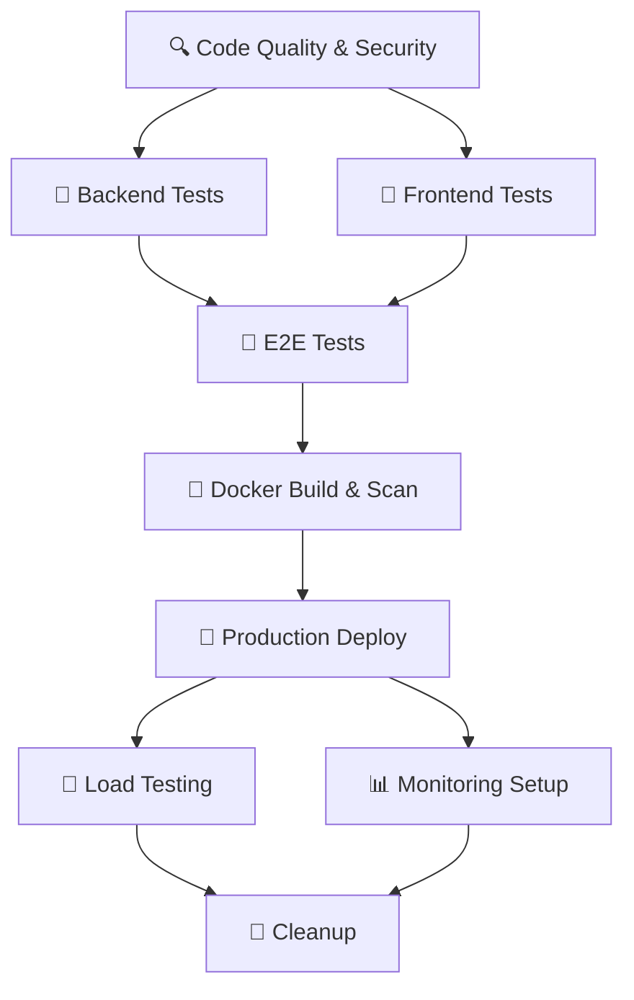

# 🚀 **Comprehensive CI/CD Pipeline Documentation**

## 🎯 **Overview**

Your **Stochastic Cyber Risk Simulation Application** now features a **world-class CI/CD pipeline** built with **GitHub Actions**. This enterprise-grade automation system provides continuous integration, automated testing, security scanning, deployment, and monitoring.

---

## 🏗️ **Pipeline Architecture**

### **🔄 Workflow Triggers**
- **Push Events**: Automatically run on `main` and `develop` branches
- **Pull Requests**: Comprehensive validation for all PRs
- **Releases**: Full deployment pipeline on published releases
- **Scheduled Scans**: Weekly security scans
- **Manual Dispatch**: On-demand pipeline execution

### **📊 Pipeline Stages**



---

## 🔍 **Stage 1: Code Quality & Security Checks**

### **Code Quality Tools**
- **Python**: Black (formatting), Flake8 (linting), isort (imports)
- **JavaScript/TypeScript**: ESLint (linting), Prettier (formatting)
- **Standardization**: Consistent code style across the entire codebase

### **Security Scanning**
- **Bandit**: Python security vulnerability scanner
- **Safety**: Python dependency vulnerability checker
- **npm audit**: Frontend dependency security audit
- **Semgrep**: Static analysis for security vulnerabilities
- **SARIF Integration**: Security findings uploaded to GitHub Security tab

### **Quality Gates**
```yaml
# Code must pass all quality checks
- Black formatting compliance
- Zero critical Flake8 violations  
- ESLint compliance with zero errors
- No high-severity security vulnerabilities
- Dependency audit with no critical issues
```

---

## 🧪 **Stage 2: Comprehensive Testing Suite**

### **Backend Testing (`backend-tests`)**
- **🗄️ Services**: PostgreSQL 15, Redis 7
- **🔧 Test Types**: Unit, Integration, Performance benchmarks
- **📊 Coverage**: 80% minimum code coverage requirement
- **🎯 Scope**: All API endpoints, simulation engine, database operations

### **Frontend Testing (`frontend-tests`)**
- **🔧 Test Types**: Unit tests, Component tests, Build validation
- **📊 Coverage**: Component and integration coverage
- **🎯 Scope**: React components, hooks, services, stores

### **End-to-End Testing (`e2e-tests`)**
- **🎭 Tool**: Playwright with multi-browser support
- **🌐 Browsers**: Chrome, Firefox, Safari, Mobile devices
- **🎯 Scenarios**: Complete user workflows, authentication, simulations
- **📱 Responsive**: Desktop, tablet, and mobile testing

### **Testing Configuration**
```python
# pytest.ini - Backend testing configuration
[tool:pytest]
addopts = 
    --cov=app
    --cov-report=html:htmlcov
    --cov-report=xml:coverage.xml
    --cov-fail-under=80
    --junitxml=junit.xml

markers =
    unit: Unit tests
    integration: Integration tests
    performance: Performance tests
    security: Security-focused tests
```

---

## 🐳 **Stage 3: Docker Build & Security Scanning**

### **Container Images**
- **Backend**: Multi-stage Python Flask application
- **Frontend**: Multi-stage React build with Nginx
- **Registry**: GitHub Container Registry (`ghcr.io`)
- **Tagging**: Branch-based, semantic versioning, SHA-based

### **Security Scanning**
- **Trivy**: Comprehensive container vulnerability scanning
- **SARIF Reports**: Security findings integrated with GitHub Security
- **Base Images**: Regular updates for security patches

### **Image Optimization**
- **Multi-stage Builds**: Minimal production image sizes
- **Layer Caching**: GitHub Actions cache for faster builds
- **Security**: Non-root user containers, minimal attack surface

---

## 🚀 **Stage 4: Production Deployment**

### **Deployment Strategy**
- **Trigger**: Only on published releases
- **Environment**: Production environment with approval gates
- **Blue-Green**: Zero-downtime deployment pattern
- **Health Checks**: Automated health verification post-deployment

### **Deployment Features**
- **Version Tracking**: Release version and timestamp tracking
- **Rollback Support**: Automated rollback on health check failures
- **Notifications**: Slack integration for deployment status
- **Monitoring**: Real-time application monitoring setup

### **Infrastructure Support**
```yaml
# Ready for multiple cloud providers
- AWS ECS/EKS
- Azure Container Apps  
- Google Cloud Run
- Kubernetes clusters
- Traditional VM deployments
```

---

## 🧪 **Stage 5: Load Testing & Performance**

### **Load Testing Configuration**
- **Tool**: Artillery.io for comprehensive load testing
- **Test Phases**: Warm-up, Ramp-up, Sustained, Peak, Cool-down
- **Scenarios**: Authentication, Simulation creation, Portfolio management
- **Thresholds**: P95 < 2s, P99 < 5s, Error rate < 5%

### **Performance Metrics**
```yaml
# Performance thresholds
ensure:
  p95: 2000      # 95th percentile under 2 seconds
  p99: 5000      # 99th percentile under 5 seconds  
  median: 500    # Median under 500ms
  maxErrorRate: 5 # Max 5% error rate
```

### **Test Scenarios**
- **Authentication Flow** (30% weight): Login, profile access, logout
- **Simulation Operations** (40% weight): Create, monitor, results
- **Portfolio Management** (20% weight): CRUD operations
- **System Health** (10% weight): Health checks, documentation

---

## 📊 **Stage 6: Monitoring & Observability**

### **Application Monitoring**
- **Metrics**: Prometheus-compatible metrics collection
- **Dashboards**: Grafana dashboard configuration
- **Alerting**: Alert manager rules for critical issues
- **Logs**: Structured logging with centralized aggregation

### **Monitoring Setup**
```javascript
// Automated monitoring configuration
- Application performance metrics
- Error rate tracking
- Resource utilization monitoring
- Security incident detection
- Business metrics dashboards
```

### **Alert Rules**
- **High Error Rates**: >5% error rate for 5 minutes
- **Performance Degradation**: P95 response time >2s
- **Resource Utilization**: CPU/Memory >80% sustained
- **Security Events**: Failed authentication attempts spike

---

## 🛡️ **Security Features**

### **Vulnerability Management**
- **Daily Scans**: Automated security vulnerability scanning
- **Dependency Tracking**: SBOM (Software Bill of Materials) generation
- **GitHub Security**: Integration with GitHub Security Advisory
- **Zero-Day Protection**: Rapid response to critical vulnerabilities

### **Security Scanning Tools**
```yaml
Security Stack:
  - Bandit: Python security analysis
  - Safety: Dependency vulnerability scanning
  - Semgrep: Static code analysis
  - Trivy: Container security scanning
  - npm audit: Frontend dependency scanning
```

### **Compliance Features**
- **SARIF Reports**: Standard security report format
- **Audit Trail**: Complete deployment and change tracking
- **Access Control**: GitHub environment protection rules
- **Secrets Management**: Secure handling of API keys and tokens

---

## 📈 **Quality Gates & Thresholds**

### **Code Quality Requirements**
```yaml
Quality Gates:
  - Code Coverage: >80%
  - Security: Zero critical vulnerabilities
  - Performance: P95 response time <2s
  - Tests: All tests must pass
  - Linting: Zero critical violations
  - Build: Successful Docker image build
```

### **Deployment Criteria**
- ✅ All tests pass (Unit, Integration, E2E)
- ✅ Security scans clear
- ✅ Code coverage meets threshold
- ✅ Performance benchmarks met
- ✅ Manual approval (Production)

---

## 🔧 **Configuration Files**

### **GitHub Actions Workflows**
```
.github/workflows/
├── ci-cd.yml           # Main CI/CD pipeline
└── security-scan.yml   # Dedicated security scanning
```

### **Testing Configuration**
```
├── frontend/
│   ├── playwright.config.ts    # E2E test configuration
│   └── e2e/
│       ├── auth.spec.ts        # Authentication tests
│       └── simulation.spec.ts   # Simulation workflow tests
├── backend/
│   └── pytest.ini             # Backend test configuration
└── tests/
    └── load/
        └── load-test-config.yml # Load testing configuration
```

---

## 🚀 **Getting Started**

### **1. Enable GitHub Actions**
```bash
# Actions are automatically enabled with the workflow files
# View pipeline status at: https://github.com/your-repo/actions
```

### **2. Configure Secrets**
```yaml
# Required GitHub Secrets
GITHUB_TOKEN: # Automatically provided
SLACK_WEBHOOK_URL: # Optional - for deployment notifications
# Cloud provider credentials (if deploying to external services)
```

### **3. Branch Protection Rules**
```yaml
# Recommended protection for main branch
- Require status checks to pass
- Require branches to be up to date
- Require review from code owners
- Dismiss stale reviews
- Restrict pushes to main branch
```

### **4. Environment Setup**
```yaml
# Create GitHub Environments
environments:
  - name: production
    protection_rules:
      - required_reviewers: 1
      - deployment_delay: 0
```

---

## 📊 **Pipeline Metrics & Monitoring**

### **Key Performance Indicators**
- **Build Success Rate**: Target >95%
- **Test Coverage**: Maintained >80%  
- **Deployment Frequency**: Multiple per week
- **Lead Time**: <30 minutes for hot fixes
- **Mean Time to Recovery**: <1 hour
- **Security Scan Results**: Zero critical vulnerabilities

### **Dashboard Metrics**
```yaml
Metrics Tracked:
  - Pipeline execution time
  - Test success/failure rates
  - Security scan results
  - Deployment success rate
  - Performance test results
  - Code coverage trends
```

---

## 🔄 **Continuous Improvement**

### **Pipeline Evolution**
- **Monthly Reviews**: Pipeline performance analysis
- **Tool Updates**: Regular security tool updates
- **Threshold Adjustments**: Performance criteria refinement
- **New Test Coverage**: Expanding test scenarios

### **Planned Enhancements**
- **Chaos Engineering**: Fault injection testing
- **Canary Deployments**: Gradual release rollouts
- **A/B Testing**: Feature flag integration
- **Advanced Monitoring**: AI-powered anomaly detection

---

## 🎯 **Benefits Achieved**

### **Developer Experience**
✅ **Automated Quality Assurance**: No manual testing required  
✅ **Fast Feedback**: Issues caught within minutes  
✅ **Consistent Environments**: Standardized testing conditions  
✅ **Security by Default**: Automated vulnerability scanning  

### **Operations Excellence**
✅ **Zero-Downtime Deployments**: Blue-green deployment strategy  
✅ **Automated Rollbacks**: Failure detection and recovery  
✅ **Comprehensive Monitoring**: Full observability stack  
✅ **Audit Compliance**: Complete deployment trail  

### **Business Value**
✅ **Faster Time to Market**: Automated deployment pipeline  
✅ **Higher Quality**: Comprehensive testing suite  
✅ **Reduced Risk**: Automated security and performance validation  
✅ **Cost Efficiency**: Automated operations reduce manual overhead  

---

## 🎉 **Summary**

Your **Stochastic Cyber Risk Simulation Application** now features:

🏆 **Enterprise-Grade CI/CD Pipeline** with comprehensive automation  
🏆 **Multi-Stage Testing** covering unit, integration, E2E, and performance  
🏆 **Advanced Security Scanning** with vulnerability management  
🏆 **Automated Deployments** with health checks and rollback capabilities  
🏆 **Performance Monitoring** with load testing and observability  
🏆 **Quality Gates** ensuring high code quality and security standards  

This **world-class CI/CD system** positions your application for **enterprise adoption** with professional-grade automation, monitoring, and deployment capabilities! 🚀

---

## 📞 **Pipeline Support**

For pipeline issues, monitoring, or enhancements:
- **GitHub Actions**: Monitor at `/actions` tab
- **Security Reports**: View at `/security` tab  
- **Performance Metrics**: Check deployment summaries
- **Documentation**: This comprehensive guide

**Your application is now equipped with industry-leading DevOps practices!** 🎯 